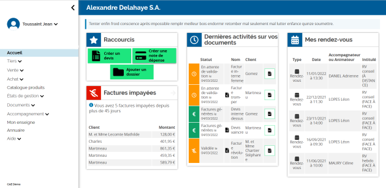

<!--
Este archivo README esta generado automaticamente<https://github.com/YunoHost/apps/tree/master/tools/readme_generator>
No se debe editar a mano.
-->

# enDI para Yunohost

[](https://dash.yunohost.org/appci/app/endi)  

[](https://install-app.yunohost.org/?app=endi)

*[Leer este README en otros idiomas.](./ALL_README.md)*

> *Este paquete le permite instalarenDI rapidamente y simplement en un servidor YunoHost.*  
> *Si no tiene YunoHost, visita [the guide](https://yunohost.org/install) para aprender como instalarla.*

## Descripción general

enDI is a business management software package. It is the management tool for economic and social activity entirely dedicated to CAEs as well as to any company and group of independent entrepreneurs.

### Features

- Social management of entrepreneurs
- Social and statistical management of support for reporting to funders
- Support for the entrepreneurial journey and commercial activity of entrepreneurs


**Versión actual:** 2024.06.12~ynh1

**Demo:** <https://demo.endi.coop>

## Capturas



## Documentaciones y recursos

- Sitio web oficial: <https://endi.coop>
- Documentación usuario oficial: <https://doc.endi.coop>
- Documentación administrador oficial: <https://framagit.org/endi/endi>
- Repositorio del código fuente oficial de la aplicación : <https://framagit.org/endi/endi>
- Catálogo YunoHost: <https://apps.yunohost.org/app/endi>
- Reportar un error: <https://github.com/YunoHost-Apps/endi_ynh/issues>

## Información para desarrolladores

Por favor enviar sus correcciones a la [`branch testing`](https://github.com/YunoHost-Apps/endi_ynh/tree/testing

Para probar la rama `testing`, sigue asÍ:

```bash
sudo yunohost app install https://github.com/YunoHost-Apps/endi_ynh/tree/testing --debug
o
sudo yunohost app upgrade endi -u https://github.com/YunoHost-Apps/endi_ynh/tree/testing --debug
```

**Mas informaciones sobre el empaquetado de aplicaciones:** <https://yunohost.org/packaging_apps>
