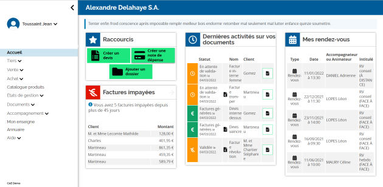

<!--
注意：此 README 由 <https://github.com/YunoHost/apps/tree/master/tools/readme_generator> 自动生成
请勿手动编辑。
-->

# YunoHost 上的 enDI

[](https://dash.yunohost.org/appci/app/endi)  

[](https://install-app.yunohost.org/?app=endi)

*[阅读此 README 的其它语言版本。](./ALL_README.md)*

> *通过此软件包，您可以在 YunoHost 服务器上快速、简单地安装 enDI。*  
> *如果您还没有 YunoHost，请参阅[指南](https://yunohost.org/install)了解如何安装它。*

## 概况

enDI is a business management software package. It is the management tool for economic and social activity entirely dedicated to CAEs as well as to any company and group of independent entrepreneurs.

### Features

- Social management of entrepreneurs
- Social and statistical management of support for reporting to funders
- Support for the entrepreneurial journey and commercial activity of entrepreneurs


**分发版本：** 2024.06.11~ynh1

**演示：** <https://demo.endi.coop>

## 截图



## 文档与资源

- 官方应用网站： <https://endi.coop>
- 官方用户文档： <https://doc.endi.coop>
- 官方管理文档： <https://framagit.org/endi/endi>
- 上游应用代码库： <https://framagit.org/endi/endi>
- YunoHost 商店： <https://apps.yunohost.org/app/endi>
- 报告 bug： <https://github.com/YunoHost-Apps/endi_ynh/issues>

## 开发者信息

请向 [`testing` 分支](https://github.com/YunoHost-Apps/endi_ynh/tree/testing) 发送拉取请求。

如要尝试 `testing` 分支，请这样操作：

```bash
sudo yunohost app install https://github.com/YunoHost-Apps/endi_ynh/tree/testing --debug
或
sudo yunohost app upgrade endi -u https://github.com/YunoHost-Apps/endi_ynh/tree/testing --debug
```

**有关应用打包的更多信息：** <https://yunohost.org/packaging_apps>
